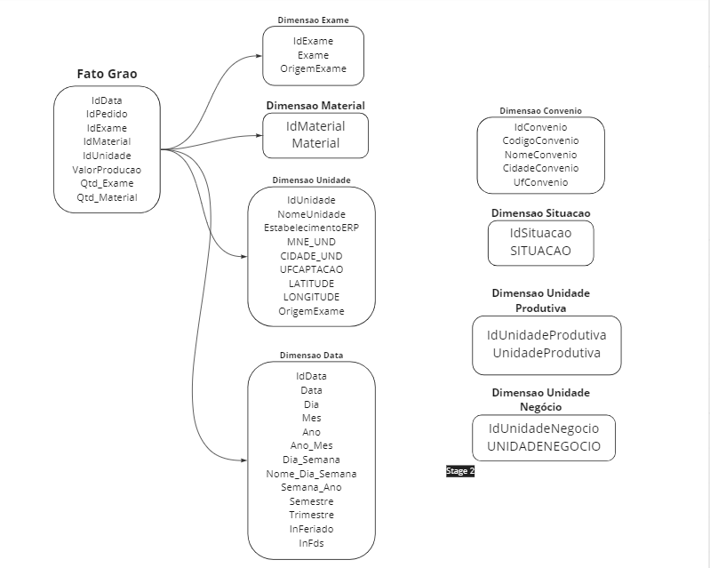

# Teste Grupo Pardini

O teste técnico do Grupo Pardini apreseta um pequeno case para analisar a visão crítica do analista e verificar como o analista poderia ajudar as demandas do dia a dia. 

Foram apresentado dois desafios. Vamos passar por um de cada vez mostrando o problema e a possível solução.

## Questão 1

Com o dataset 1 crie um fluxo completo de carga utilizando o MSSMS e SSIS para construir uma estrutura de dadso com fato e dimensão que será utilizada pelos clientes. O pipeline deve conter avisos relacionado a qualquer falha que possa ocorrer. Além disso, criar a documentação completa da nova estrutura. E programar o job para que seja executada duas vezes ao dia. Uma de madrugada e uma no ínicio da tarde.

Sugerir algumas querys para o cientista de dados e analistas de dados que achar relevante. 

Obs1: O menor grão da fato é Pedido + Unidade + Exame + Material e data utilizada é a Data do Laudo.

### Solução:

Nossa solução foi criar um ETL utilizando a linguagem de programação Python e seus respectivos pacotes. Primeiro criamos o database dentro do SQL Server Management Studio. O código que gerou o database está dentro do diretório Q1 com nome 'CREATE_DATABASE.sql'. 

Logo após a criação do Database, importamos as tabelas 'DATASET 1', 'PRE_ANALITICO' e 'GLOBAL_PRODUCAO' para o SSMS. 

Após estudo feito na tabela 'DATASET 1', foi desenvolvido o modelo de dados dela e também a criação das tabelas Fatos e Dimensões que podem ser vistos no arquivo 'CREATE_TABLE.sql' no diretório 'Q1'.

Segue abaixo o modelo de dados da questão 1:

O ETL está desenvolvido no script 'ETL_FATO.ipynb', porém, como que o cliente necessita que o job seja programado para rodar duas vezes ao dia, foram criados dois arquivos com a intenção de utiliza-los no Agendador de Tarefas do Windows. Os arquivos 'file.bat' e 'ETL_FATO.py' serviram para realizar o job duas vezes ao dia pelo Agendador de Tarefas. Além disso, o script 'ETL_FATO.py' utiliza dos scripts dos diretórios 'fato' e 'dimensao' para manter as tabelas atualizadas do modelo de dados.

As querys sugeridas para os Analistas de Dados e Cientista de Dados estão dentro do diretório 'Q1' no arquivo 'QUESTAO1.sql'.

## Questão 2

Os datasets PRE_ANALITICO e GLOBAL_PRODUÇÃO, são utilizados constantemente no Grupo Pardini para estudos diversos. Faça o JOIN entre eles gerando um único dataset com as informações que julgar relevante. Deixar querys anexadas. 

OBS: O grão das tabelas é a composição entre ID_PEDIDO, ID_UNIDADE, MNEMÔNICO e TIPO_MATERIAL.

### Solução:

A solução foi construída utilizando o SSMS e as querys da solução se encontra no diretório 'Q2' no arquivo 'QUESTAO_2.sql'.

Dentro dessa consulta, temos diferentes análises. Segue algumas delas:

- 
